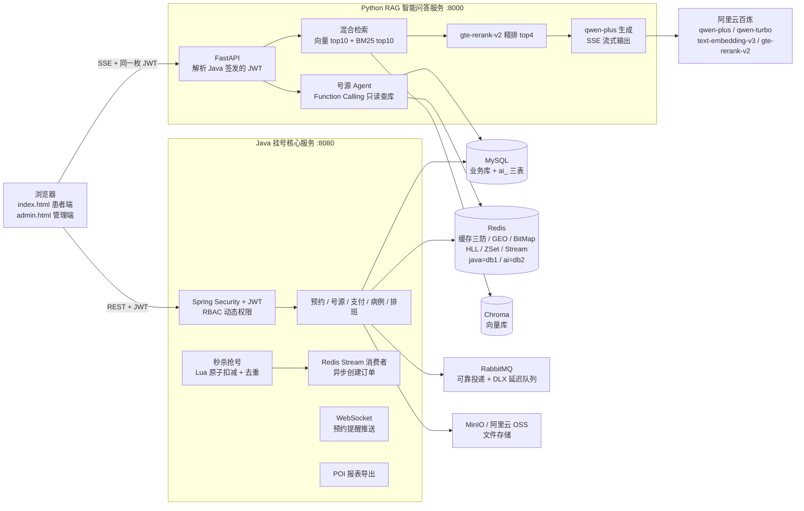

<div align="center">

# 医秒通 · 智慧医院预约挂号平台

**Spring Boot 挂号核心服务 × LangChain RAG 智能问答 —— 秒级抢号 + AI 导诊一体化的双服务架构**


</div>

---

## 📖 项目简介

医秒通是一个前后端分离的医院预约挂号平台，解决两个核心场景：

1. **热门号源秒级抢占**：专家号开放瞬间大量用户涌入，通过 Lua 脚本原子扣减 + Redis Stream 异步下单，抢号接口全程纯内存操作，数据库压力后移；
2. **患者咨询智能导诊**：基于 LangChain 构建 RAG 知识库问答服务，混合检索 + 重排序保证回答准确性，Function Calling Agent 实时查询余号，SSE 流式输出。

系统由两个服务组成，通过 **JWT 共享密钥打通身份**（Java 源码零修改接入 AI 能力）：

| 服务 | 技术栈 | 端口 | 职责 |
| --- | --- | --- | --- |
| 挂号核心服务 | Java 17 / Spring Boot | 8080 | 账号权限、预约挂号、秒杀抢号、支付、病例、排班、报表 |
| RAG 智能问答服务 | Python / FastAPI / LangChain | 8000 | 知识库管理、混合检索问答、号源查询 Agent、会话与限流 |

## ✨ 功能全景

### 用户端（患者）

| 模块 | 功能 |
| --- | --- |
| 账号登录 | 短信验证码 / 账号密码双方式登录，验证码 Redis 限时校验，JWT 无状态鉴权 |
| 首页浏览 | 医院 / 专科 / 医生 / 健康资讯，**GEO 附近医院**，医院·医生详情 **UV 统计**，**医生好评排行榜 Top10** |
| 预约挂号 | 出诊计划搜索、号源余量实时查询、预约 / 取消、当天排队叫号、就诊后评分、就诊前一天短信提醒 |
| 秒杀抢号 | 热门专家号秒级抢号，库存实时查询（与普通预约共享同一套 Lua 库存） |
| 支付中心 | 钱包余额、挂号费支付 / 退款、交易流水、订单 15 分钟超时自动取消 |
| 关注 Feed | 关注 / 取关医院、共同关注、关注医院资讯 **Feed 流滚动分页**推送 |
| 健康打卡 | 每日签到（**Redis BitMap**）、当月签到日历、连续签到天数 |
| 就诊卡 | 多就诊卡增删改查、数目限制与信息校验 |
| 病例 / 信用 | 我的病例查询、爽约失信记录、当月信用查询 |
| AI 智能问答 | 挂号流程 / 退号规则等知识库问答（SSE 流式）、实时余号查询（Agent）、历史会话管理、点赞点踩反馈 |

### 管理端

| 模块 | 功能 |
| --- | --- |
| 号源与预约 | 出诊计划排班、预约管理、预约黑名单（爽约惩罚） |
| 医疗资源 | 医院 / 专科 / 医生信息维护，文件上传（MinIO / 阿里云 OSS） |
| 数据统计 | 仪表盘概览，挂号量 / 营收 / 注册趋势，科室排行、医生热度、状态与时段分布，**POI 一键导出 Excel 报表** |
| 权限体系 | RBAC 账号-角色-资源三级管理、动态权限拦截、登录 / 操作日志 |
| 内容与用户 | 健康资讯发布、用户与病例管理、支付订单管理 |
| AI 知识库 | 知识文档上传 / 切分入库 / 删除（仅管理员，向量 + BM25 双索引同步重建） |

## 🖼 界面预览

<!-- 截图放入 docs/img/ 后取消注释
| 患者端 · 预约挂号 | 患者端 · AI 智能问答 |
| --- | --- |
|  |  |

| 管理端 · 号源计划 | 管理端 · 知识库管理 |
| --- | --- |
|  |  |
-->

## 🏗 系统架构



## 🚀 技术栈

| 分类 | 技术 |
| --- | --- |
| 后端核心 | Java 17、Spring Boot 2.7.18、Spring Security + JWT（RBAC 动态权限）、MyBatis-Plus 3.5.5、PageHelper |
| AI 服务 | Python 3.10+、FastAPI、LangChain 1.0、Chroma 向量库、jieba + BM25、阿里云百炼（qwen-plus / qwen-turbo / text-embedding-v3 / gte-rerank-v2） |
| 中间件 | MySQL 8.0、Redis（Lettuce + Redisson）、RabbitMQ、MinIO / 阿里云 OSS |
| 其他 | Knife4j（OpenAPI3 接口文档）、Apache POI 报表、WebSocket、Hutool、Lombok |

## 💡 核心亮点

**① 高并发抢号链路**
- **Lua 脚本秒杀**：库存校验 + 一人一单去重 + 库存扣减在一条 Lua 脚本内原子完成，抢号接口全程纯内存操作；
- **双入口统一库存**：普通预约与秒杀页共用同一套 Lua 脚本和 Redis 库存，从源头杜绝两套口径导致的超卖；
- **Redis Stream 异步下单**：抢号成功即返回，订单由独立消费者从 Stream 消费落库削峰填谷；消费失败不 ACK、进 PendingList 兜底重试，NOGROUP 异常自愈重建，保证最终一致性；
- **Redisson 分布式锁**：生产者 / 消费者共用同一把锁互斥，兜底重复下单；全局唯一 ID = 时间戳 + Redis 自增序列。

**② Redis 深度应用**
- **多级缓存架构**（CacheClient 统一封装）：**Caffeine L1 本地缓存**纳秒级响应 → **布隆过滤器**拦截一定不存在的 Key → Redis L2 分布式缓存 → 数据库回源，四级防线层层过滤；互斥锁 / 逻辑过期 + 异步重建双策略防击穿，空值缓存防穿透，TTL 随机抖动防雪崩；互斥锁重试超限自动降级直查 DB，防线程空转堆积；
- **BitMap 签到**：一人一月仅占 31 bit，位运算生成签到日历、统计连续签到天数；
- **GEO 附近医院**：按距离排序返回周边医院；**HyperLogLog** 统计医院 / 医生详情页 UV，内存恒定 12KB；
- **ZSet 好评榜**：就诊评分实时更新医生排行 Top10；**Feed 流**：关注医院资讯推模式投递收件箱，ZSet 滚动分页解决新内容插入导致的传统分页重复 / 漏读。

**③ RAG 智能问答（LangChain）**
- **LangGraph 主从 Agent 架构**：Supervisor 意图识别 + 任务路由 → knowledge_worker（RAG 知识回答）/ slot_worker（Function Calling 号源查询），大小模型分工降本；
- **Langfuse 全链路可观测**：按需启用，Trace 采集检索耗时、精排得分、Token 消耗、引用覆盖率；未配置时自动降级为空操作，不影响核心链路；
- **混合检索**：向量召回（text-embedding-v3，1024 维）top10 + BM25（jieba 分词）top10 → 去重 → **gte-rerank-v2 精排 top4**，兼顾语义与关键词匹配；
- **号源 Agent**：Function Calling 只读查库，优先读 Redis 秒杀库存、回退 DB 计算，余号口径与 Java 端完全一致；
- **SSE 流式输出**：`sources → delta*N → done` 协议逐字渲染，前端按 content-type 区分流式 / 错误响应；qwen-turbo 小模型负责多轮指代消解改写，大小模型分工降本；
- **服务治理**：热点问答缓存（md5 归一化，号源类实时问题禁缓存）、会话上下文定长裁剪、ZSET 滑动窗口限流（20 次/分/用户）+ 每日 token 额度。

**④ 消息驱动与工程化**
- **DLX 延迟队列**：预约成功后投递延迟消息，就诊前一天 20:00 自动转入提醒队列发送短信；**TTL 设在消息级而非队列级**，避免 RabbitMQ 取 min(队列TTL, 消息TTL) 截断长延迟；
- **可靠投递**：publisher-confirm 发送确认 + 消费端手动 ACK + 失败重试；预约状态变更 Fanout 广播多渠道通知；
- **双服务身份打通**：Python 端直接解析 Java 签发的 JWT（HS256 共享密钥），**Java 源码零修改**；管理员身份三表联查判定 + Redis 缓存 30 分钟；
- **WebSocket**：预约 / 取消实时推送管理端（对标来单 / 催单提醒）；**POI** 导出统计报表；RBAC 动态权限按路径实时鉴权。

## 🎯 技术难点与解决方案

| 难点 | 方案 | 效果 |
| --- | --- | --- |
| 秒杀超卖 / 一人多单 | 校验、去重、扣减合并为一条 Lua 脚本原子执行 | 100 并发压测吞吐 156+/s、平均耗时 182ms，0 异常 0 超卖 |
| 预约与秒杀两套库存口径漂移 | 双入口统一走同一 Lua 脚本与 Redis 库存 | 单一数据源，口径恒一致 |
| 异步下单消息丢失 | 消费失败不 ACK → PendingList 兜底重试 + NOGROUP 自愈重建 | 订单最终一致，消息不丢 |
| 热点 key 击穿 / 恶意穿透 | 互斥锁与逻辑过期双策略 + 空值缓存 + TTL 随机抖动 | 缓存重建期 DB 仅 1 次回源 |
| Feed 流传统分页读漂移 | ZSet score 记时间戳 + lastId/offset 滚动分页 | 新资讯插入不重不漏 |
| 长延迟消息被队列 TTL 截断 | DLX 死信队列 + 消息级 TTL（队列不设 TTL） | 任意时长延迟准点触达 |
| AI 回答余号与业务库存不一致 | Agent 只读优先 Redis 秒杀库存、回退 DB 同口径计算 | AI 与业务端数据一致 |

## ⚡ 快速启动

### 前置依赖

JDK 17+、Maven 3.6+、Python 3.10+、MySQL 8.0、Redis 6+（RabbitMQ、MinIO 可选，默认配置已排除）

```bash
git clone https://github.com/JayJayYu159852/yimiaotong.git
```

> **⚠️ 启动顺序**：必须先启动 Java 服务（:8080），再启动 RAG 服务（:8000），因为 RAG 服务依赖 Java 端的 MySQL 库。
> **AI 聊天提示"网络异常"** → 99% 是 RAG 服务未启动或端口冲突。

---

### 1. 启动 MySQL 和 Redis

确保 MySQL 3306 端口、Redis 6379 端口已连通。

---

### 2. 初始化数据库

```sql
-- 执行建库脚本（含表结构与演示数据）
source hospital-master/src/main/resources/hospital.sql
```

---

### 3. 启动 Java 挂号服务（:8080）

```bash
cd hospital-master
# 复制配置模板并填入 MySQL/Redis 密码、JWT 密钥等
cp src/main/resources/application-example.yml src/main/resources/application.yml
# 启动（默认端口 8080）
mvn spring-boot:run
```

首次启动需 `mvn compile` 编译，后续可直接 `mvn spring-boot:run`。

**验证启动成功**：浏览器访问 `http://localhost:8080/hospital/index.html` 能看到患者端首页。

---

### 4. 启动 Python RAG 服务（:8000）

```bash
cd rag-service

# 首次部署：创建虚拟环境并安装依赖
python -m venv .venv
.venv/Scripts/python -m pip install -r requirements.txt

# 首次部署：复制配置模板并填入真实信息
cp .env.example .env
# .env 需要填：
#   - DASHSCOPE_API_KEY（阿里云百炼，必须）
#   - JWT_SECRET（与 Java 端 application.yml 的 jwt.secret 一致，必须）
#   - MYSQL_PASSWORD（与 Java 端一致，必须）
#   - REDIS_PASSWORD（与 Java 端一致，必须）
#   - LANGFUSE_PUBLIC_KEY / LANGFUSE_SECRET_KEY（可选，不配则自动关闭可观测）

# 首次部署：建 ai_ 三表（幂等，反复运行无副作用）
.venv/Scripts/python init_db.py

# 导入示例知识文档（可选，--replace 清理同名旧文档后重建）
.venv/Scripts/python import_docs.py --replace

# ▶ 启动服务（每次开机都要执行这一行）
.venv/Scripts/python -m uvicorn app.main:app --port 8000
```

**验证启动成功**：浏览器访问 `http://localhost:8000/api/health?deep=true` 返回 `{"code":200}`。

**修改 .env 或代码后**：需按 `Ctrl+C` 停止后重新执行启动命令（未开 --reload）。

---

### 5. 访问

| 入口 | 地址 | 说明 |
| --- | --- | --- |
| 患者端 | http://localhost:8080/hospital/index.html | 挂号、AI 问答 |
| 管理端 | http://localhost:8080/hospital/admin.html | 排班、报表、知识库管理 |
| Java 接口文档（Knife4j） | http://localhost:8080/hospital/doc.html | Swagger |
| RAG 接口文档 | http://localhost:8000/docs | FastAPI Swagger |
| RAG 健康检查 | http://localhost:8000/api/health?deep=true | 确认服务状态 |

> 演示管理员账号：`admin / admin`，更多测试账号见 `hospital.sql`。

## 📁 目录结构

```
.
├── hospital-master/                # Java 挂号核心服务（Spring Boot :8080）
│   └── src/main/
│       ├── java/cn/liyu/hospital/
│       │   ├── controller/         # admin 管理端 / user 用户端接口
│       │   ├── service/            # 业务层（预约、秒杀、支付、排班…）
│       │   ├── component/          # WebSocket、Stream 消费者、MQ、UV 统计
│       │   ├── config/             # Security、Redis、Redisson、MQ 配置
│       │   └── common/             # 统一响应体、JWT、安全组件
│       └── resources/
│           ├── hospital.sql        # 建库脚本
│           ├── seckill.lua         # 秒杀原子脚本
│           └── static/             # index.html / admin.html 前端页面
├── rag-service/                    # Python RAG 智能问答服务（FastAPI :8000）
│   └── app/
│       ├── api/                    # chat / kb / auth / health 路由
│       ├── rag/                    # 加载、切分、向量化、检索、重排、Agent
│       ├── services/               # 会话、缓存、限流
│       ├── core/                   # 配置、统一响应、JWT 鉴权
│       └── db/                     # MySQL / Redis 客户端与模型
└── docs/img/                       # README 截图资源
```

## 📄 许可证

本项目遵循 [GPL-3.0](hospital-master/LICENSE) 开源协议。
