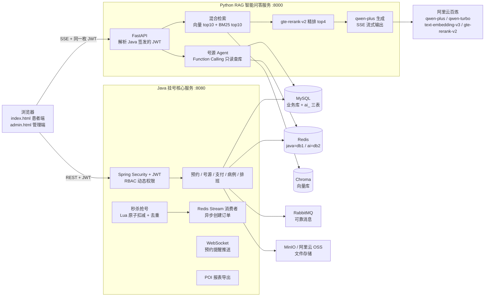

<div align="center">

# 医秒通 · 智慧医院预约挂号平台

**Spring Boot 挂号核心服务 × LangChain RAG 智能问答 —— 秒级抢号 + AI 导诊一体化的双服务架构**


</div>

---

## 📖 项目简介

医秒通是一个前后端分离的医院预约挂号平台，解决两个核心场景：

1. **热门号源秒级抢占**：专家号开放瞬间大量用户涌入，通过 Lua 脚本原子扣减 + Redis Stream 异步下单，抢号接口全程纯内存操作，数据库压力后移；
2. **患者咨询智能导诊**：基于 LangChain 构建 RAG 知识库问答服务，混合检索 + 重排序保证回答准确性，Function Calling Agent 实时查询余号，SSE 流式输出。

系统由两个服务组成，通过 **JWT 共享密钥打通身份**（Java 源码零修改接入 AI 能力）：

| 服务 | 技术栈 | 端口 | 职责 |
| --- | --- | --- | --- |
| 挂号核心服务 | Java 17 / Spring Boot | 8080 | 账号权限、预约挂号、秒杀抢号、支付、病例、排班、报表 |
| RAG 智能问答服务 | Python / FastAPI / LangChain | 8000 | 知识库管理、混合检索问答、号源查询 Agent、会话与限流 |

> 🌐 在线体验：部署上线后更新

## 🖼 界面预览

<!-- 截图放入 docs/img/ 后取消注释
| 患者端 · 预约挂号 | 患者端 · AI 智能问答 |
| --- | --- |
|  |  |

| 管理端 · 号源计划 | 管理端 · 知识库管理 |
| --- | --- |
|  |  |
-->

## 🏗 系统架构



## 🚀 技术栈

| 分类 | 技术 |
| --- | --- |
| 后端核心 | Java 17、Spring Boot 2.7.18、Spring Security + JWT（RBAC 动态权限）、MyBatis-Plus 3.5.5、PageHelper |
| AI 服务 | Python 3.10+、FastAPI、LangChain 1.0、Chroma 向量库、jieba + BM25、阿里云百炼（qwen-plus / qwen-turbo / text-embedding-v3 / gte-rerank-v2） |
| 中间件 | MySQL 8.0、Redis（Lettuce + Redisson）、RabbitMQ、MinIO / 阿里云 OSS |
| 其他 | Knife4j（OpenAPI3 接口文档）、Apache POI 报表、WebSocket、Hutool、Lombok |

## 💡 核心亮点

**高并发抢号**
- **Lua 脚本秒杀**：库存校验 + 一人一单去重 + 扣减在一条 Lua 脚本内原子完成，抢号接口不碰数据库；
- **Redis Stream 异步下单**：抢号成功即返回，订单由独立消费者线程从 Stream 消费落库，削峰填谷；
- **Redisson 分布式锁**：兜底防止极端场景下的重复下单；全局唯一 ID 由 Redis 自增 + 时间戳拼接生成。

**RAG 智能问答**
- **混合检索**：向量召回（text-embedding-v3，1024 维）top10 + BM25（jieba 分词）top10 → 去重 → **gte-rerank-v2 精排 top4**，兼顾语义与关键词匹配；
- **号源 Agent**：Function Calling 只读查库，优先读 Redis 秒杀库存、回退 DB 计算，余号口径与 Java 端完全一致；
- **SSE 流式输出**：`sources → delta*N → done` 协议，逐字渲染，前端按 content-type 区分流式/错误响应；
- **多轮改写**：qwen-turbo 小模型负责指代消解与问题改写，大小模型分工降本。

**双服务身份打通**
- Python 端直接解析 Java 签发的 JWT（HS256 共享密钥），**Java 源码零修改**；
- 管理员身份 = 账号表 ⋈ 角色关系表 ⋈ 角色表 三表联查判定，结果 Redis 缓存 30 分钟。

**缓存与稳定性**
- 热点问答缓存（问题 md5 归一化，号源类实时问题禁止缓存）、会话上下文（Redis List 定长裁剪）；
- ZSET 滑动窗口限流（20 次/分/用户）+ 每日 token 额度控制；
- 缓存击穿/穿透防护、HyperLogLog UV 统计、RabbitMQ publisher-confirm + 手动 ack + 失败重试；
- WebSocket 实时推送预约提醒，POI 导出统计报表。

## ⚡ 快速启动

### 前置依赖

JDK 17+、Maven 3.6+、Python 3.10+、MySQL 8.0、Redis 6+（RabbitMQ、MinIO 可选，默认配置已排除）

### 1. 初始化数据库

```sql
-- 执行建库脚本（含表结构与演示数据）
source hospital-master/src/main/resources/hospital.sql
```

### 2. 启动 Java 挂号服务

```bash
cd hospital-master
# 复制配置模板并填入 MySQL/Redis 密码、JWT 密钥等
cp src/main/resources/application-example.yml src/main/resources/application.yml
mvn spring-boot:run
```

### 3. 启动 Python RAG 服务

```bash
cd rag-service
python -m venv .venv
.venv/Scripts/python -m pip install -r requirements.txt   # Linux/Mac 为 .venv/bin/python
cp .env.example .env                                      # 填入百炼 API-KEY、JWT 密钥（与 Java 端一致）
.venv/Scripts/python init_db.py                           # 建 ai_ 三表（幂等）
.venv/Scripts/python import_docs.py --replace             # 导入示例知识文档（可选）
.venv/Scripts/python -m uvicorn app.main:app --port 8000
```

### 4. 访问

| 入口 | 地址 |
| --- | --- |
| 患者端 | http://localhost:8080/hospital/index.html |
| 管理端 | http://localhost:8080/hospital/admin.html |
| Java 接口文档（Knife4j） | http://localhost:8080/hospital/doc.html |
| RAG 接口文档（Swagger） | http://localhost:8000/docs |
| RAG 健康检查 | http://localhost:8000/api/health?deep=true |

> 演示管理员账号：`admin / admin`，更多测试账号见 `hospital.sql`。

## 📁 目录结构

```
.
├── hospital-master/                # Java 挂号核心服务（Spring Boot :8080）
│   └── src/main/
│       ├── java/cn/liyu/hospital/
│       │   ├── controller/         # admin 管理端 / user 用户端接口
│       │   ├── service/            # 业务层（预约、秒杀、支付、排班…）
│       │   ├── component/          # WebSocket、Stream 消费者、MQ、UV 统计
│       │   ├── config/             # Security、Redis、Redisson、MQ 配置
│       │   └── common/             # 统一响应体、JWT、安全组件
│       └── resources/
│           ├── hospital.sql        # 建库脚本
│           ├── seckill.lua         # 秒杀原子脚本
│           └── static/             # index.html / admin.html 前端页面
├── rag-service/                    # Python RAG 智能问答服务（FastAPI :8000）
│   └── app/
│       ├── api/                    # chat / kb / auth / health 路由
│       ├── rag/                    # 加载、切分、向量化、检索、重排、Agent
│       ├── services/               # 会话、缓存、限流
│       ├── core/                   # 配置、统一响应、JWT 鉴权
│       └── db/                     # MySQL / Redis 客户端与模型
└── docs/img/                       # README 截图资源
```

## 📄 许可证

本项目遵循 [GPL-3.0](hospital-master/LICENSE) 开源协议。
